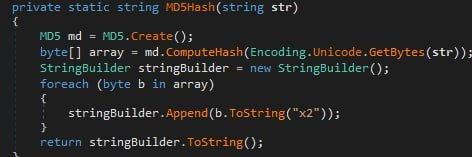
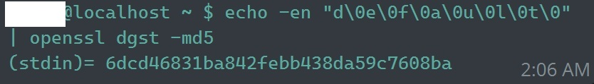

# Introduction
Friend of mine found one of these handheld Raman Spectrometers used, but was stymied by the login page.  I offered to take a look if they could get me a dump of the firmware, which they did.

# Walkthrough

Inspecting the file shows that it is a 1.8GB .bin file generated by imageUSB. imageUSB adds a 512-byte header that trips up losetup when trying to mount it as a loop device. I was able to use [these instructions](https://obscurerichard.wordpress.com/2021/02/13/reading-images-created-with-imageusb-on-windows-via-linux) to successfully mount it, by issuing:
```
losetup --find --show <firmware.bin> -o 512 -p
mount /dev/loop24p1 /mnt/Firmware/
```

Now I could explore the firmware. Most of the files were binary, but I did find a lead under /WebAdmin/Bin after letting Ghidra hammer away at WebAdmin.Padarn.Module.dll, when it reported back that it was a .Net Managed DLL. This meant I could instead bring to bear dnSpyEx, which provides a much more enjoyable experience in decompiling. 

I explored several functions, and suggested that if they had write access to the firmware, they might be able to patch the DLL to erase the auth check altogether, out of the CheckUserAuthentication function. 

Another idea I tried was to test the original password for the account, because the password set when no users exist is in fact "default", but this didn't work. 

Figuring I was still looking in the right place, I continued exploring, and found the function referenced when generating passwords  AND found that it saves the last 6 password hashes for each user.  For those, like me, confused by the ToString("x2") that they're doing to each byte in the hash, this converts them to two-byte Hexadecimal (more on this later).

I dug a little more into the name of the module, [Padarn](https://opennetcf.wordpress.com/padarn/), and found that it is a lightweight small-footprint ASP.NET web server, and considered that it may be worth hunting through the source to find vulnerabilities.

However, at this point I started peeking at some of the binary files, and was pleasantly surprised. In the root of the firmware as a TruScanDB1.sdf. This is a SQL Server Compact Edition Database, and a quick peek inside showed what looked like username/md5 hash combinations. 

Frustratingly, it's incredibly challenging to open a SQL Server CE DB written by a library that's a decade or more old. Most of the common tools out there (LINQPad, CompactView, SQLCEQuery, etc) failed in some form or another. I finally had success with a trial of [SDF Viewer](https://www.flyhoward.com/SDF_Viewer.aspx). This allowed me to easily copy the MD5 hashes of the passwords. 

Remember that line for two-byte hexadecimal? This is where I would have tripped up, if not for a friend pointing out what was going on. I threw the hashes in a couple places, including Crack Station. Nothing. Didn't even recognize them as MD5 hashes. Thankfully, having wasted only about 5 minutes, said friend recognized and pointed out that Windows CE often utilizes UCS-2 encoding. This is also known as utf-16le. Manually testing this theory, we find that yes, the original password for the Administrator account was default.   It does appear that they have change it since.

Thankfully, at this point we can bring to bear everyone's favorite hash evaluation tool, Hashcat! Even better, looking through the modes of Hashcat shows that while Mode 0 is MD5 (and won't work for us), Mode 70 is labelled "md5(utf16le($pass))" which is exactly what we want!  I chose to throw RockYou against it with OneRuleToRuleThemAll, since it was MD5 and I was lucky enough to throw a 4090 at the problem. Within a few seconds, it spit back out:
```
099d1a206ffe8359e0b619b58cc85de6:twister
```
Which means we've now taken control of the Administrator account! While I waited for confirmation from my friend that they could log in with the password, I let my GPU continue to hammer away, and by the end of it we had an additional 9. 
This got us all but two of the active accounts according to the database.

We waited impatiently... 

My friend confirmed they were able to log in!  By this point it was 3 AM so I decided to call it.

# Hash List

If you're feeling excitable, feel free to try your hand at the un-cracked hashes. If you get any throw 'em my way as an issue and I'll update and credit you.
```
099d1a206ffe8359e0b619b58cc85de6:twister
1d88bbca0d837b5c68531fcc541a7e6c:diosynth
25935f5479af15cec4cf212ebe99709d
33105d1e821681f60484eb8db98f8a28
87cbb7a7e1cd5d73d50f2843d6c859a1:Redskins1!
f8338a41412b3e5605e9a51cb42e1df3:diosynth1
6dcd46831ba842febb438da59c7608ba:default
c59adcba80edac9bf019ba7223a6209e
d6a437a7e6ac001d143775442d08d9ac
37efa39c2494587b16d10be553c9b711
0795fa7d36e0dafc4964de4c58a7c4d1
4e7a49c47fac0a7d318cb0fd3f2f04dd
32f38a431986438aadb5c2dc4d1596e8:pw1
034b0a3d79d8bc217226d8430bb34f10:pw2a
fda29650dbbe2cf379eea8ab37b7e438:pw3
a6b3ade7d2b1e5393484a8d99cbb1570:pw4a
e165eb791befb1ba0dfc2594b3e9ae84:pw4
```
